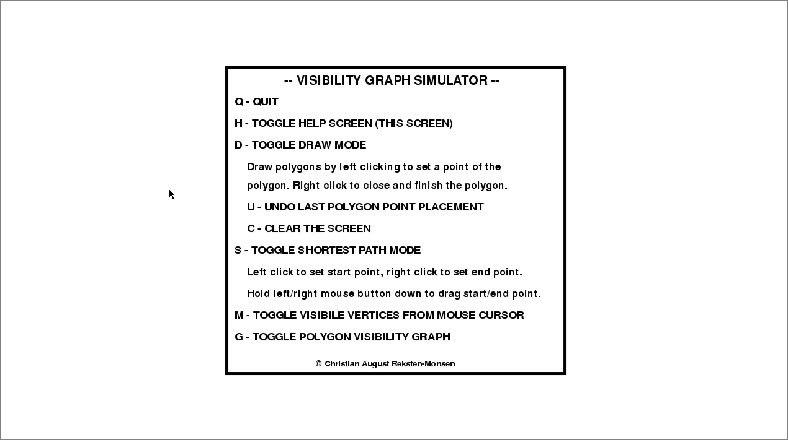

# Visibility Graph Simulator

[](/LICENSE.txt)

See how visibility graphs work in a interactive way using [Pyvisgraph](https://github.com/TaipanRex/pyvisgraph)
and [Pygame](https://github.com/pygame/pygame). Create obstacle polygons with the mouse and see how 
visibility graphs work in different ways. Find the shortest path between two points.



## Requirements

* [Pyvisgraph](https://github.com/TaipanRex/pyvisgraph) >= 0.2.1
* [Pygame](https://github.com/pygame/pygame)
* Python 3

## Installation

```shell
git clone https://github.com/TaipanRex/visgraph_simulator.git
cd visgraph_simulator
python3 visgraph_simulator/visgraph_simulator.py
```

## Windows installer

Please go to the [releases](https://github.com/TaipanRex/visgraph_simulator/releases) page and
download the msi installer for the latest version of Visibility Graph simulator.
